# Swift Image Processing

This project contains swift playgrounds that demonstrate how to do pixel operations in swift.

 * Swift3 : checkout master branch
 * Swift2.x : checkout syntax/swift2.x branch

## Thanks to RGBAImage

* [http://mhorga.org/2015/10/19/image-processing-in-ios-part-3.html](http://mhorga.org/2015/10/19/image-processing-in-ios-part-3.html)
* This articles help me a lot!

## Convert UIImage to RGBA Image
RGBAImage has pixels flat memory. You can access pixels with index directly.

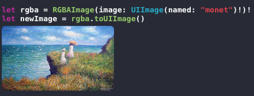

## Contrast 
This is example for pixel operation

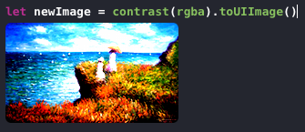

```swift
let rgba = RGBAImage(image: UIImage(named: "monet")!)!

var totalR = 0
var totalG = 0
var totalB = 0

rgba.process { (pixel) -> Pixel in
    totalR += Int(pixel.R)
    totalG += Int(pixel.G)
    totalB += Int(pixel.B)
    return pixel
}

let pixelCount = rgba.width * rgba.height
let avgR = totalR / pixelCount
let avgG = totalG / pixelCount
let avgB = totalB / pixelCount

func contrast(image: RGBAImage) -> RGBAImage {
    image.process { (var pixel) -> Pixel in
        let deltaR = Int(pixel.R) - avgR
        let deltaG = Int(pixel.G) - avgG
        let deltaB = Int(pixel.B) - avgB
        pixel.R = UInt8(max(min(255, avgR + 3 * deltaR), 0)) //clamp
        pixel.G = UInt8(max(min(255, avgG + 3 * deltaG), 0))
        pixel.B = UInt8(max(min(255, avgB + 3 * deltaB), 0))
        
        return pixel
    }
    return image
}
let newImage = contrast(rgba).toUIImage()
```
## Grab color space

### Grab Red component
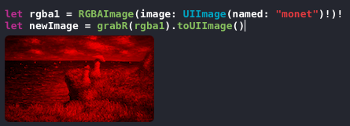

```swift
func grabR(image: RGBAImage) -> RGBAImage {
    var outImage = image
    outImage.process { (var pixel) -> Pixel in
        pixel.R = pixel.R
        pixel.G = 0
        pixel.B = 0
        return pixel
    }
    return outImage
}
```

### Grab Green component

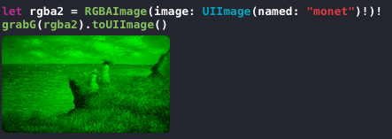

```swift
func grabG(image: RGBAImage) -> RGBAImage {
    var outImage = image
    outImage.process { (var pixel) -> Pixel in
        pixel.R = 0
        pixel.G = pixel.G
        pixel.B = 0
        return pixel
    }
    return outImage
}
```
### Grab Blue component

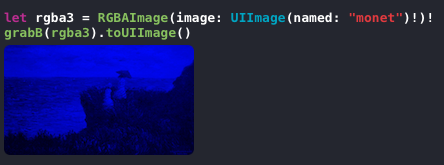

```swift
func grabB(image: RGBAImage) -> RGBAImage {
    var outImage = image
    outImage.process { (var pixel) -> Pixel in
        pixel.R = 0
        pixel.G = 0
        pixel.B = pixel.B
        return pixel
    }
    return outImage
}
```
### Compose RGB Color components

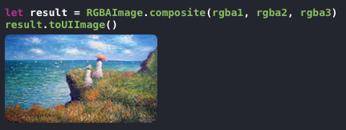

```
public static func composite(rgbaImageList: RGBAImage...) -> RGBAImage {
    let result : RGBAImage = RGBAImage(width:rgbaImageList[0].width, height: rgbaImageList[0].height)
    for y in 0..<result.height {
        for x in 0..<result.width {
            
            let index = y * result.width + x
            var pixel = result.pixels[index]
            
            for rgba in rgbaImageList {
                let rgbaPixel = rgba.pixels[index]
                pixel.Rf = min(pixel.Rf + rgbaPixel.Rf, 1.0)
                pixel.Gf = min(pixel.Gf + rgbaPixel.Gf, 1.0)
                pixel.Bf = min(pixel.Bf + rgbaPixel.Bf, 1.0)
            }
            
            result.pixels[index] = pixel
        }
    }
    return result
}
```

## RGB to Gray
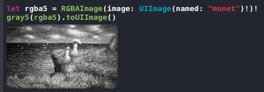

```swift
func gray5(image: RGBAImage) -> RGBAImage {
    var outImage = image
    outImage.process { (var pixel) -> Pixel in
        let result = sqrt(pow(pixel.Rf, 2) + pow(pixel.Rf, 2) + pow(pixel.Rf, 2))/sqrt(3.0)
        pixel.Rf = result
        pixel.Gf = result
        pixel.Bf = result
        return pixel
    }
    return outImage
}
let rgba5 = RGBAImage(image: UIImage(named: "monet")!)!
gray5(rgba5).toUIImage()
```

## Refactoring Split Color Space
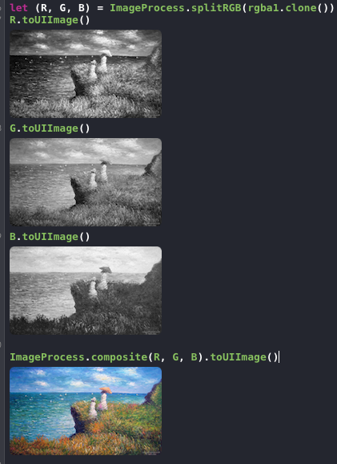

```swift
public static func splitRGB(rgba: RGBAImage) -> (ByteImage, ByteImage, ByteImage) {
    let R = ByteImage(width: rgba.width, height: rgba.height)
    let G = ByteImage(width: rgba.width, height: rgba.height)
    let B = ByteImage(width: rgba.width, height: rgba.height)
    
    rgba.enumerate { (index, pixel) -> Void in
        
        R.pixels[index] = pixel.R.toBytePixel()
        G.pixels[index] = pixel.G.toBytePixel()
        B.pixels[index] = pixel.B.toBytePixel()
    }

    return (R, G, B)
}
```
`ByteImage` has only one color component. 

## Images ADD, SUB, MUL, DIV
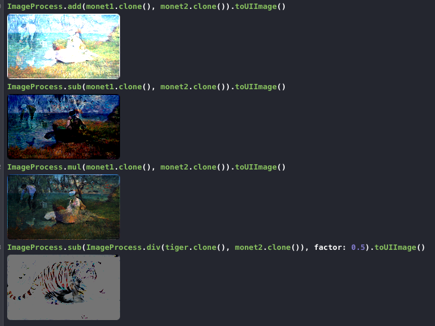

```swift
public static func op(functor : (Double, Double) -> Double, rgbaImage1: RGBAImage, rgbaImage2: RGBAImage) -> RGBAImage {
    let result : RGBAImage = RGBAImage(width:rgbaImage1.width, height: rgbaImage1.height)
    for y in 0..<result.height {
        for x in 0..<result.width {
            
            let index = y * result.width + x
            var pixel = result.pixels[index]
            
            let rgba1Pixel = rgbaImage1.pixels[index]
            let rgba2Pixel = rgbaImage2.pixels[index]
            
            
            pixel.Rf = min(functor(rgba1Pixel.Rf, rgba2Pixel.Rf), 1.0)
            pixel.Gf = min(functor(rgba1Pixel.Gf, rgba2Pixel.Gf), 1.0)
            pixel.Bf = min(functor(rgba1Pixel.Bf, rgba2Pixel.Bf), 1.0)
            
            result.pixels[index] = pixel
        }
    }
    return result

}
public static func add(rgba1: RGBAImage, _ rgba2: RGBAImage) -> RGBAImage {
    return op((+), rgbaImage1: rgba1, rgbaImage2: rgba2)
}
```

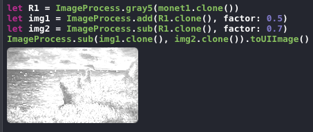

## Blending
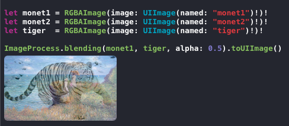

```swift
public static func blending(img1: RGBAImage, _ img2: RGBAImage, alpha: Double) -> RGBAImage {
    let result : RGBAImage = RGBAImage(width:img1.width, height: img1.height)
    for y in 0..<result.height {
        for x in 0..<result.width {
            
            let index = y * result.width + x
            var pixel = result.pixels[index]
            
            let pixel1 = img1.pixels[index]
            let pixel2 = img2.pixels[index]
            
            
            pixel.Rf = min( alpha * pixel1.Rf + (1.0 - alpha) * pixel2.Rf, 1.0)
            pixel.Gf = min( alpha * pixel1.Gf + (1.0 - alpha) * pixel2.Gf, 1.0)
            pixel.Bf = min( alpha * pixel1.Bf + (1.0 - alpha) * pixel2.Bf, 1.0)
            
            result.pixels[index] = pixel
        }
    }
    return result
}
```

## Brightness
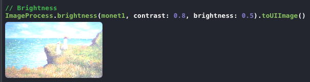

```swift
public static func brightness(img1: RGBAImage, contrast: Double, brightness: Double) -> RGBAImage {
    let result : RGBAImage = RGBAImage(width:img1.width, height: img1.height)
    for y in 0..<result.height {
        for x in 0..<result.width {
            
            let index = y * result.width + x
            var pixel = result.pixels[index]
            
            let pixel1 = img1.pixels[index]
            
            pixel.Rf = min( pixel1.Rf * contrast + brightness, 1.0)
            pixel.Gf = min( pixel1.Gf * contrast + brightness, 1.0)
            pixel.Bf = min( pixel1.Bf * contrast + brightness, 1.0)
            
            result.pixels[index] = pixel
        }
    }
    return result
}
```

## Convolution

```swift
public static func convolution(var image: ByteImage, mask: Array2D<Double>) -> ByteImage {
        
    let height = image.height
    let width  = image.width
    
    let maskHeight = mask.rowCount()
    let maskWidth  = mask.colCount()
    
    for y in 0..<height - maskHeight + (maskHeight-1)/2 {
        for x in 0..<width - maskWidth + (maskWidth-1)/2 {
            var v = 0.0
            if (y+maskHeight > height) || (x+maskWidth) > width {
                continue
            }
            
            for my in 0..<maskHeight {
                for mx in 0..<maskWidth {
                    let tmp = mask[my, mx]
                    v = v + (image.pixel(x+mx, y+my)!.Cf * tmp)
                }
            }
            
            v = clamp(v, lower: 0.0, upper: 1.0)
            print(v)
            let pixel = BytePixel(value: v)
            let xx = x+(maskWidth-1)/2
            let yy = y+(maskHeight-1)/2
            image.setPixel(xx, yy, pixel)
        }
    }
    return image
}
```

### Sharpening
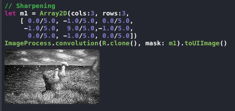

```swift
let m1 = Array2D(cols:3, rows:3,
    [ 0.0/5.0, -1.0/5.0, 0.0/5.0,
     -1.0/5.0,  9.0/5.0,-1.0/5.0,
      0.0/5.0, -1.0/5.0, 0.0/5.0])
ImageProcess.convolution(R.clone(), mask: m1).toUIImage()
```

### Bluring
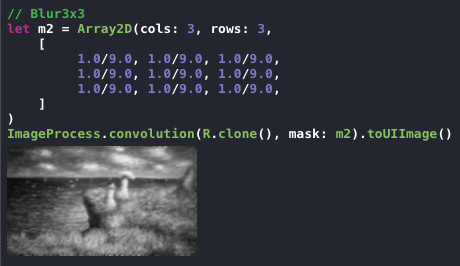

```swift
let m2 = Array2D(cols: 3, rows: 3,
    [
         1.0/9.0, 1.0/9.0, 1.0/9.0,
         1.0/9.0, 1.0/9.0, 1.0/9.0,
         1.0/9.0, 1.0/9.0, 1.0/9.0,
    ]
)
ImageProcess.convolution(R.clone(), mask: m2).toUIImage()
```


## MIT License

The MIT License

Copyright © 2015 Sungcheol Kim, https://github.com/skyfe79/SwiftImageProcessing

Permission is hereby granted, free of charge, to any person obtaining a copy
of this software and associated documentation files (the "Software"), to deal
in the Software without restriction, including without limitation the rights
to use, copy, modify, merge, publish, distribute, sublicense, and/or sell
copies of the Software, and to permit persons to whom the Software is
furnished to do so, subject to the following conditions:

The above copyright notice and this permission notice shall be included in
all copies or substantial portions of the Software.

THE SOFTWARE IS PROVIDED "AS IS", WITHOUT WARRANTY OF ANY KIND, EXPRESS OR
IMPLIED, INCLUDING BUT NOT LIMITED TO THE WARRANTIES OF MERCHANTABILITY,
FITNESS FOR A PARTICULAR PURPOSE AND NONINFRINGEMENT. IN NO EVENT SHALL THE
AUTHORS OR COPYRIGHT HOLDERS BE LIABLE FOR ANY CLAIM, DAMAGES OR OTHER
LIABILITY, WHETHER IN AN ACTION OF CONTRACT, TORT OR OTHERWISE, ARISING FROM,
OUT OF OR IN CONNECTION WITH THE SOFTWARE OR THE USE OR OTHER DEALINGS IN
THE SOFTWARE.
